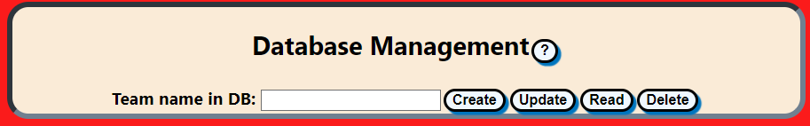

# PurdueDex Project


A pokedex app built with [React JS](https://reactjs.org). The application uses the [PokeAPI](https://pokeapi.co) to request information about pokemon and illustrate the use of hooks and user interactions while navigating the list of available pokemon.

This application was developed as the final project of the ReactJS course offered by Purdue IEEE and sponsored by the College of Engineering at Purdue University in the Spring of 2023.

# Requirements

* [NodeJS](https://nodejs.org/en)
* [NPM](https://www.npmjs.com) (installed with NodeJS)

# Installation

```
git clone https://github.com/JuanSMartinez/purdue-dex.git
cd purdue-dex
npm install
```

While on the `purdue-dex` directory, start the application with the database features disabled by checking out the `firebase-disabled` branch:

```
git checkout firebase-disabled
npm start
```

To start the application with all the features, only run `npm start` on the `main` branch.


# Features

## Pagination of the complete list of available pokemon for easy navigation


Navigate through all the pokemon in a list of pages. Each page contains 12 clickable thumbnails.

## View selected pokemon details


After clicking on a thumbnail, the pokemon artwork, front sprite, shiny sprite (if any), types and base stats are displayed.

## Add or remove a selected pokemon to a team 


Clicking on "Add to Team" or "Remove from Team" will add or remove the selected pokemon to a list of maximum 6 pokemon.

## Database capabilities (only on the main branch)



The application on the main branch of the repository contains database functionality using a Realtime database in [Firebase](https://firebase.com/).

The team of 6 pokemon can be stored in the database by a unique name given by the user when clicking on "Create". Each team in the database must have a unique name. A team of a given name can also be updated with a different selection of 6 pokemon by clicking on "Update". A team of pokemon can be retrieved from the database by supplying its name and clicking on "Read". Finally, a team will be deleted from the database after providing its name and clicking on "Delete".

The database stores teams in the following structure:

```
{
    created_on: <date when the team was first stored>
    updated_on: <date of the latest update to the team>
    pokemon: [<list of maximum 6 JSON pokemon data>]
}
```

The JSON pokemon data is the same as returned by the [PokeAPI](https://pokeapi.co) at the pokemon endpoint, i.e., the data returned from a request of the form `https://pokeapi.co/api/v2/pokemon/{id or name}/`

In the `firebase-disabled` branch, the selection of 6 pokemon cannot be stored in a database.
