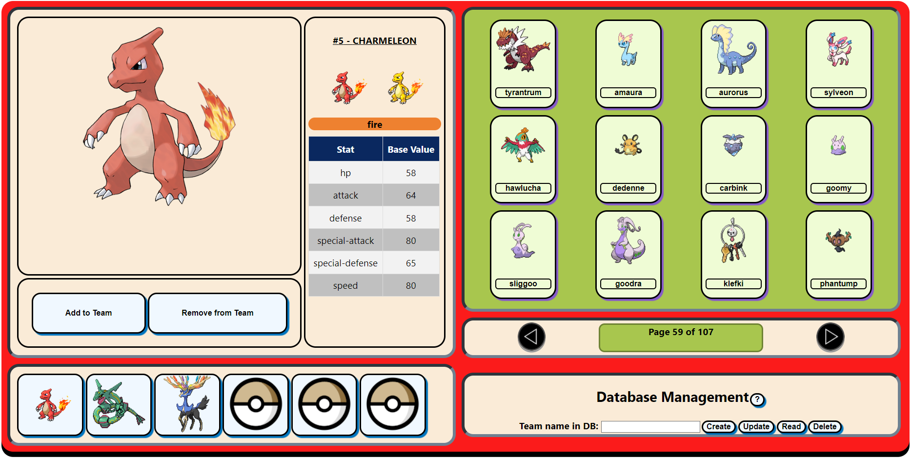
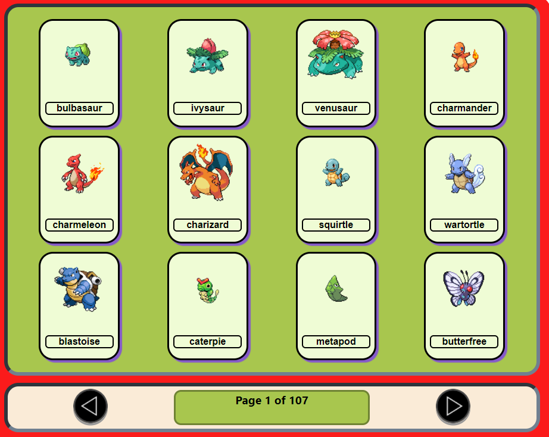
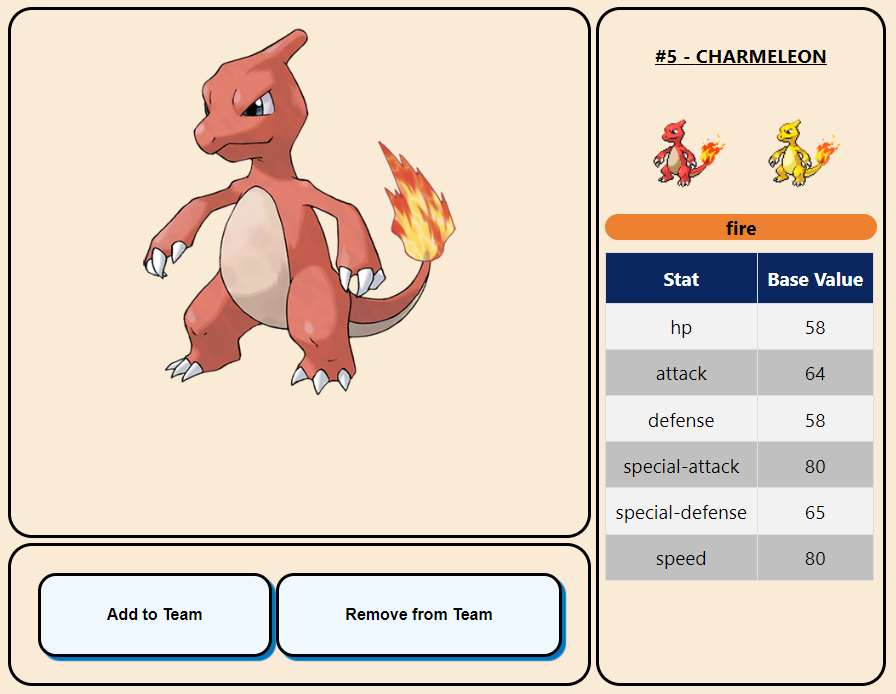

# PurdueDex Project

A pokedex app built with [React JS](https://reactjs.org). The application uses the [PokeAPI](https://pokeapi.co) to request information about pokemon and illustrate the use of hooks and user interactions while navigating the list of available pokemon.

# Features

## Pagination of the complete list of available pokemon for easy navigation

Navigate through all the pokemon in a list of pages. Each page contains 12 clickable thumbnails.

## View selected pokemon details

After clicking on a thumbnail, the pokemon artwork, front sprite, shiny sprite (if any), types and base stats are displayed

## Add or remove a selected pokemon to a team 
